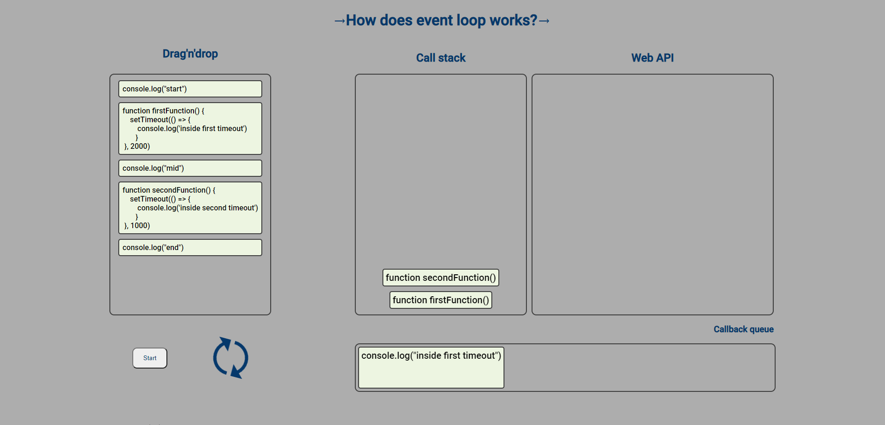

## Демонстрация работы eventloop в браузере

#### Сейчас используется

- React
- react-beautiful-dnd
- styled-components
- gsap

#### В планах реализовать:

- [x] Версия 1.0
- [ ] Добавление функционала (callbacks, fs.readFile, promise, setImmediate etc.)
- [ ] Перенос кода на ts
- [ ] Визуальные изменения

